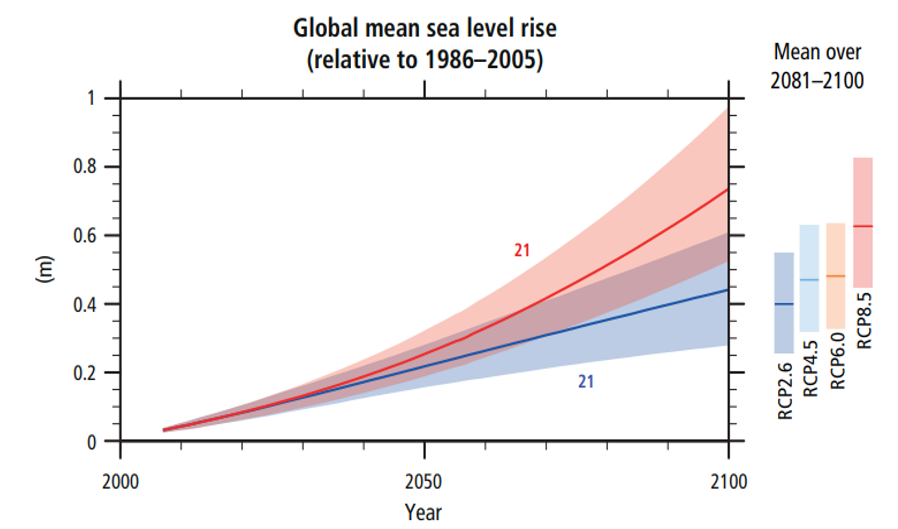

# Limits on Greenhouse Gases

The rate at which the biosphere can absorb manmade (anthropogenic) greenhouse gases (GHG) without
serious changes of the global surface temperature and ocean pH is about 5-10 Gt CO2eq/y[^1][^2]. This is far
less than the current rate of global emissions (56 Gt CO2eq in 2015[^3]). At the present rate, only a minor
part of GHG emissions is taken up by plants and soils while the oceans and the atmosphere act as
reservoirs for storing the remainder. Direct consequences of the increasing concentrations of
greenhouse gases in the atmosphere and of CO2 in the ocean are:
* a rising average surface temperature (ca 0.35 °C per 1000 Gt of cumulative CO2eq emissions),
and,
* an increasing acidity of the oceans (a drop in pH of 0.1 at 2000 Gt of cumulative CO2).

Historical data (1970-2015) show that the rate of the world’s GHG emissions increased approximately linearly with time:
$$GHG \\ [Gt \\ CO_2eq/y] = 50 + 0.6(y - 2010)$$
 
Different scenario’s for future GHG emissions
exist, in which these emissions accelerate or
slow down in comparison to the historical trend.
For each scenario, an average temperature rise
can be predicted from the cumulative emissions.

Particularly important for humans are the nonlinear,
indirect effects of GHG emissions:
* Sea level rise (see box below);
* Changing precipitation patterns;
* Geographical shifts of plant/animal species;
* Changes in crop productivity and the spread
of vector/water-borne diseases;
* Migration of human populations.

Analysts at the IPCC estimate that these indirect effects will become critical at a 2°C rise of the average
global surface temperature (at a cumulative GHG emission of ca 5500 Gt CO2eq). A major problem
with cutting GHG emissions is that decisions on the reduction of these emissions rest primarily with
investors in the fossil fuel and cement industries, and particularly with investors from China, the US
and Europe, whereas the adverse effects of GHG emissions (food shortage, disease, flooding) act
primarily upon poor and middle class people, more particularly in Africa and South America. In
numbers, about 2/3 of world GHG emissions of 2015 was from fossil fuel use and industrial processes2,
and out of the 36 Gt of CO2 emissions from fossil fuel and cement, 20 Gt came from China, the US and
Europe3. This fundamental conflict of interests and the fact that predictions of the societal costs of
emissions due to indirect effects are not supported (yet) by experimental data complicates negotiations
between the various stakeholders.

[^1]: Estimated from data of the International Panel on Climate Change. Note that the term CO2eq indicates that the effect of emissions of methane and N2O are included next to CO2.
[^2]: IPCC, 2014: Climate Change 2014: Synthesis Report. Contribution of Working Groups I, II and III to the Fifth Assessment Report of the Intergovernmental Panel on Climate Change.
[^3]: PBL Netherlands EAA, Trends in Global CO2 emissions: 2016 report.
