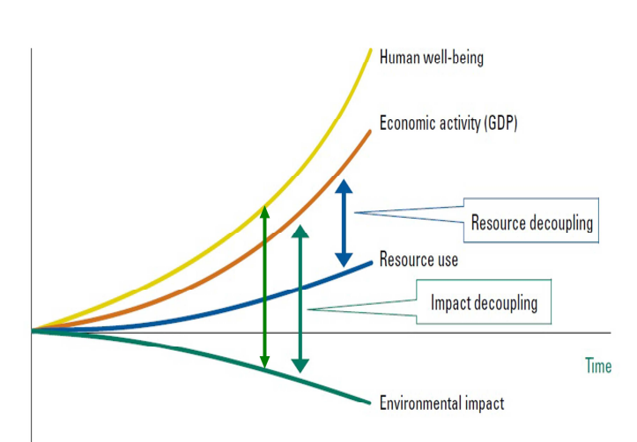

# Circular Economy Definitions

The main purpose of Circular Economy (CE) is to decouple human well-being and economic activity (GDP)
from both resource use and environmental impact. Focusing on economic activity (GDP) and resource use,
this means that we do want the economy to grow but we do not want to increase the resource use at the same
pace. Taking into consideration economic activity (GDP) and environmental impact, implementing circular
economy entails an increase in economic activity and a simultaneous improvement of the environmental
conditions (see figure below). In this figure, a graphic representation of the concept of ‘Decoupling’ is portrayed (UNEP, 2011).

The same considerations apply when looking at the trends of human well-being, resource use and
environmental impact in the figure. Implementing circular economy means to improve human well-being and
at the same time reducing environmental impact. To realize this it is necessary: (1) Providing more human
well-being per unit of economic output, (2) using less resource per unit of economic output, and (3) reducing
environmental impact of the economic activities that are undertaken. To strengthen the link between use of
resources and environmental impact it is also necessary (4) making only products that contribute to wellbeing,
(5) making these products last as long as possible and (6) convert EoL products back to resources.
Circular Economy models maintain the added value in products for as long as possible and minimise waste.
They keep resources within the economy when products no longer serve their functions so that materials can
be used again and therefore generate more value (Pearce and Turner, 1990). Thus, circular business models
create more value from each unit of natural resource compared to traditional linear models (Di Maio and
Rem, 2015).

The concept of Circular Economy is of great interest to both scholars and practitioners because it is viewed
as an operationalization for businesses to implement the much-discussed concept of sustainable development
(SD) (Ghisellini et al., 2016; Murray et al., 2017). However sustainable development has been called too
vague to be implementable and has thus started to lose momentum (Kirchherr et al. 2017). This means that
academics, practitioners and governmental people are using this concept in different contexts. As
consequence, the CE concept might become blurred as it has happened to concepts as green economy and
sustainable development (SD) (Gladek, 2017; de Vries and Petersen, 2009).

Many definitions of CE have been proposed in the last years (e.g. Kirchherr (Kirchherr et al. 2017) collected
114 CE definitions). However there is still no commonly accepted definition of CE. Therefore there is the
risk that a concept with various understandings may ultimately collapse or remain in a deadlock due to
permanent conceptual contention (Hirsch and Levin, 1999; Bocken et al., 2017; Blomsma and Brennan,
2017) as it has happened to Sustainable Development.

Below four definitions of CE are given:
1. Geng and Doberstein (2008) define CE as *“realization of closed loop material flow in the whole
economic system”*.
2. Yuan et al. (2006) define CE as follow: *“the core of CE is the circular (closed) flow of materials and
the use of raw materials and energy through multiple phases”*
3. Stahel (1982) defines CE as “*an economy based on a “spiral-loop system” that minimizes matter,
energy-flow and environmental deterioration without restricting economic growth or social and
technical progress*”).
4. Preston (2012) believes that: “*Central to the CE is the idea that open production systems − in which
resources are extracted, used to make products and become waste after the product is consumed −
should be replaced by systems that reuse and recycle resources and conserve energy*”
