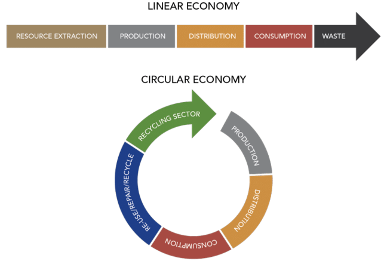

# Circular Economy Indicators

Although the CE approach contrasts with the mind-set embedded in most current industrial operations
where even the terminology (value chain, supply chain, end user) expresses a linear view, several
benefits may rise from the shift to the [Circular Economy](https://njeapp2.github.io/RWE-Track/Atom11/Page11) model and to a more [resource-efficient](https://njeapp2.github.io/RWE-Track/Atom10/Page10) path.
The material saving potential arising from the transition to a CE model and to a more resource efficient
path is estimated to 500 billion € per year for the European industry (Europe INNOVA, 2012). The job
creation potential of remanufacturing and recycling in Europe is estimated at one million (Ellen Mac
Arthur Foundation, 2014). From the strategic point of view the benefits of the CE approach arise from
the reduced risk of supply disruption and price volatility as well as from the huge potential for
innovation related to new technologies (needed to increase resource productivity, material substitution,
waste management and recycling), improvements of the forward and reverse cycles (optimization of
the supply chain and logistics) and business models (Di Maio and Rem, 2015).
Moreover the adoption of CE practices appears as a timely, relevant and practical option to meet the
goals of Sustainable Development (SD).

Accordingly, the CE paradigm is being extensively explored by institutions as a possible path to
increase the sustainability of our economic system (Elia et al., 2017). To some, e.g. Linder et al.
(2017), the ultimate goal of a CE is a SD. Anyway it is clear that both concepts need appropriate means
of measurement and evaluation to make good progress. That’s why the measurement of circularity is
gaining much attention among the academic community.
The main questions raised by researchers are (Saidani et al., 2018):
* How to measure the progress of the transition towards a CE? (Potting et al., 2016);
* How should we measure its performance since its objectives (e.g. reduce, reuse, recycle) are substantially different from those in the traditional linear economy? (EASAC, 2016);
* How is circularity measured in businesses and economies? (Bocken et al., 2017);
* How should product-level circularity be measured? (Linder et al., 2017).

Therefore, it is commonly acknowledged that to promote CE, the introduction of monitoring and
evaluation tools like indicators to measure and quantify this progress becomes essential (Di Maio and
Rem, 2015; Su et al., 2013; Geng et al., 2012).
As seen in [Atom 11](https://njeapp2.github.io/RWE-Track/Atom11/Page11) (Circular Economy Definitions), even definitions of CE that sound logical and
comprehensive, do not really capture the essence of CE.
Due to the common understanding and agreement about the importance of indicators to measure
progresses and to facilitate the transition towards CE (and SD), many CE indicators have been
proposed so far. Saidani (Saidani et al. 2018) collected and analyzed 55 circularity indicators.

Different methodologies are used to measure circularity at macro, meso and micro
levels. A large number of approaches use environmental impact assessment (e.g. Figge and Hahn,
2004; Heijungs,1992). The main purpose of these approaches is to assess the environmental impact that
results from making or using a product. However, most of such indicators cannot provide information
about environmental impact thresholds and the related desired policy targets, because it is not clear
what the real bio-physical limits are before crucial tipping points are exceeded. For example, it is
difficult to establish how much toxins can be released into a river without affecting the wellbeing of the
flora and fauna living in it and of the humans interacting with it. Moreover LCA based tools are quite
expensive because they require large amount of data and therefore are time consuming. They are also
complex to extent that different LCA studies may deliver vastly different results for the same subject.
In addition LCA studies provide information only on the environmental domain of sustainability,
neglecting the economic and social ones which should be addressed simultaneously (Thomassen, M.A.,
et al.2009).

Another metric to measure circularity uses economy-wide material flow accounting (EW-MFA)
(Wiedmann et al., 2012). In particular this approach has been adopted by governments and authorities.
For example, the European Commission proposes ‘resource productivity,’ defined as gross domestic
product (GDP) divided by domestic material consumption (DMC). To include the upstream raw
materials related to imports and exports originating from outside the local economy, material footprint
indicators have been proposed (Wiedmann et al., 2012).

Nevertheless, these material flow productivity indicators in the form of ratios of (value added)/(amount
of material in mass) are not that precise in describing the link with policy and they do not reflect
anything that plays a role in decision making. Stating that European domestic material consumption
(DMC) per capita was around 13 tonnes in 2014 does not offer any guidance for making Europe less
dependent on raw material import. This is because the mass mentioned does not distinguish, for
instance, the use of minerals from the use of rare earth metals. Whereas the consumption of some
minerals is not a concern from a sustainability, geopolitical, economic or environment point of view,
the use of a specific rare earth metal is. It is clear that if we overexploit such scarce resources, we
prevent somebody else from using them now and in the future.

Although EW-MFA indicators have been mainly developed by governmental organizations (e.g. the
European Commission) to address the economic policies, expert experiences in reviewing progress of
these indicators toward numerical targets, have revealed several practical problems with the calculated
indicators. For instance the time-lag in the availability of data and the fact that EW-MFA indicators are
inherently macroscopic so that it is difficult to observe the direct effects of individual efforts to achieve
CE (Moriguchi, Y. 2007).
