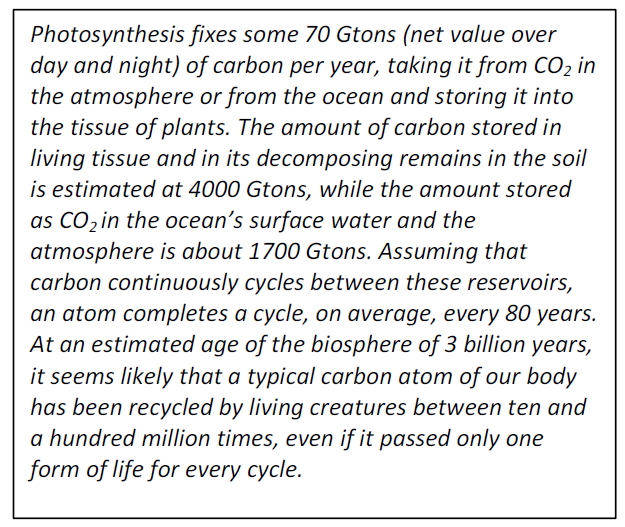

# Sustainability and the Circular Economy

The biosphere of the Earth is a remarkably circular system. Elements and compounds that are basic to
life are continuously recycled between plants, animals and the soils, oceans and atmosphere (see box
below for *Carbon*).

Before the appearance on Earth of human
beings, and even for some time after, the
circular nature of the Earth’s biosphere
provided an endless supply of all resources
needed for life, without any rules other than
the laws of nature. Recently, however,
mankind has started to use resources such as
coal or metal ores and pollute the environment
at a rate that exceeds the regenerative and
restorative capacity of the biosphere. This has
raised the question how our society should
respond to make the biosphere sustainable
again. In 1987, Mrs. Gro Harlem Brundtland
formulated the following abstract basic
guiding principle[^1][^2]:

*“… to make development sustainable to ensure that it meets the needs of the present without
compromising the ability of future generations to meet their own needs.”*

Starting from this principle, a particular strategy is now being proposed to make the biosphere
sustainable again. This strategy is to “design” the economy of products and services in such a way that
it is *regenerative* and *restorative*:
* All material resources used in making and using these products and services will be
regenerated, and,
* Our society and the environment will be restored from any negative impacts resulting from
their production and use[^3].

A society satisfying these requirements is called a *circular economy*.

[^1]: Report of the World Commission on Environment and Development: “Our Common Future”, August 4, 1987.
[^2]: Brundtland’s statement is a specific case of the more general principle that the liberty of any man to act is limited only by the rights of others (to do the same): “La liberté est le pouvoir qui appartient à l’homme de faire tout ce qui ne nuit pas aux droits d’autrui”, Declaration of human rights, Article 6, 1793.
[^3]: See, for example, the definition of a circular economy by the Ellen McArthur Foundation.
