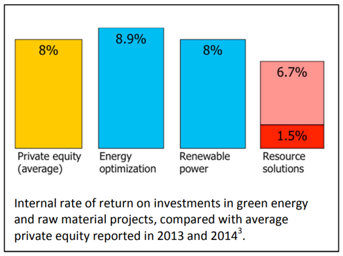

# Transition to biomaterials and green energy

The two main drivers for replacing fossil resources by renewables are to reduce Greenhouse gas
emissions and to avoid resource insecurity. The potential impact of these linear risks on the living
environment and prosperity of people depends strongly on where they live and who they are. In fragile
regions, these impacts mostly affect the average citizen and small businesses that have their assets
locked in houses and local infrastructure, and indirectly they affect the banks that finance these
stakeholders’ debts[^1]. On the other side of the scale are shareholders and businesses within the oil, gas
and fossil chemicals sector, and owners of power plants: also known as industries “relying on one-way
flow” and “not carrying their environmental costs”. These latter parties feel a circular risk: their assets
may strand, or in any case perform less well financially, by the transition to circularity. In between are
large companies and finance groups who can operate in either economy, but do need to time their
investments for the transition from linear to circular markets. To understand what makes the balance
swing, economically, socially and technologically, we should look at Europe, as an example of an
advanced economy that presently relies on imported fossil resources, yet is vulnerable to linear risks
like oil and gas dependency, and social instability caused by large-scale immigration or sea level rise.

From 2005, European gross domestic energy consumption went down by about 1% per year to approx.
1600 million tons of oil-eq. in 2015. In 2015, 72% of gross domestic energy was produced from fossil
and the share of renewable energy (13% in 2015) grew by 0.8% per year between 2009 and 2015. If
these trends continue, the amount of fossil-based energy will go down from 1200 million tons of oil-eq
in 2015 to 400 million tons in 2050. The reduction of 800 million tons roughly corresponds to net
imports in 2015, thus fulfilling EU strategic goals. This rate of reduction will also reduce Greenhouse
gas emissions to near zero near the end of the century. Whereas the statistics look OK for energy, the
biomaterial transition, making polymers from bio-resources, is not going well, and neither has the
production of polymers from oil been cut as a result of smart product design or recycling.

Analysts mention as main reasons for the general
lack of investment in circular value chains: high
transition costs, policy barriers, but, most of all,
uncertainty about the strategic direction of the
value chain[^2]. The problem is not that green
investments of the past do not perform well
financially (see Figure[^3]). Apparently, businesses
and their investors feel unsure about the
conflicting interests of poorly informed citizens
and old industries with strong lobbies in
governments and regulatory bodies, or they see a
problem in cheap linear solutions competing with
more expensive circular ones. They wish for a
clear sign that the EU will push for circularity. In
response, the EU promised yearly multi-billion euro investments until 2025 in the circular transition of
mobility, food and the built environment. Industries have responded by asking their member states to
multiply the EU effort.

[^1]: Frido Kraanen, PGGM, Working group Finance report, 2016
[^2]: Systemiq, Sun Institute, Ellen McArthur Foundation, Achieving “Growth Within”, 2017
[^3]: Cambridge Associates, Cleantech Investments, 2013, 2014
