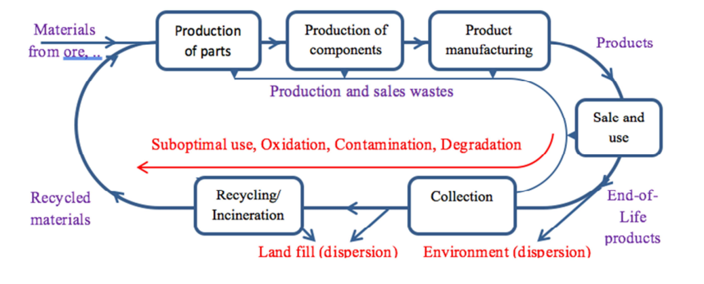

# Losses from a Circular Economy

If we say that materials are lost from the cycle, we do not mean that elements such as Fe (iron), Cu
(copper) or P (Phosphor) physically vanish. Indeed, apart from some rare cases[^1], most elements are
conserved within the biosphere. Even if we lose sight of our End-of-Life products, because they end up
in a landfill, or worse, into the environment, it doesn’t mean that the elements or materials from which
they were made are irretrievably lost. If we say that materials are lost from the cycle, we mean that the
*cost* of
* recovering the elements or materials (from the discarded products)
    - into a bulk (industrial) material flow,
    - at a useful concentration, and then,
* regenerating them back to a quality level at which they can be used for making new products,

is *too high* to be considered an option (for the short run). In other words, discarding materials in some
(uncontrolled) ways makes them no longer available as resources in an *economic sense.*

Losses from the cycle may be temporary or permanent. If the cost of recovery and regeneration of a
material from waste is too high in relation to alternative resources (e.g. ores, oil or gas and coal), then
the loss from the cycle may be temporary: the material may be recovered and regenerated at some later
time when alternative resources run out. If the cost is too high in relation to the functional value of the
material in products, then the material is truly lost, unless a technology breakthrough reduces the cost
to recover and regenerate it. Temporary or permanent losses of materials from the cycle can lead to a
loss of our standard of living, because products can no longer be produced or only at a higher cost.

We may generalize the findings above by saying that in every production cycle an amount of material
value is lost. If a material ends up in a form and place from which it is too expensive to recover and
regenerate it, then all material value is lost. If the material is still economically fit for some form of
reuse, yet, as a result of oxidation, degradation, contamination or suboptimal application, it is less
functional than at the start of the cycle, then only part of the material value is lost. The figure below
shows the main mechanisms (red) in the cycle that create a loss of material value.

[^1]: More specifically, H2 and He are lost into space from the atmosphere and elements like uranium are consumed in nuclear
reactions.
