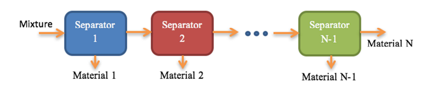
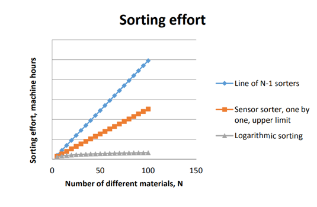

# Sorting Complex Wastes

Post-consumer wastes are waste flows originating from End-of-Life (EoL) products. Examples are
packaging waste from households, EoL vehicles and Waste from Electric and Electronic Equipment
(WEEE). Post-consumer wastes are often extremely complex, containing literally hundreds of different
materials: polymers of all kinds of grades and colours, metal alloys, as well as structured materials like
Printed Circuit Boards (PCB’s) and types of coated glass. Shredding or cutting these wastes produces
particles of as many different materials and, on top of that, also non-liberated particles (particles
containing more than a single material). An important question for realising a circular economy is
whether pure materials can be recovered efficiently from complex wastes. A fundamental question is
how the effort of separating mixtures of particles scales with the number *N* of different materials.

### *N* - 1 Sorters in a line
The most intuitive way to answer this question is to assume that for each material there exists a
machine that is able to extract (virtually) all the particles of this material from the mix. Suppose that
separators are put in sequence; all separators have the same process capacity *C* [kg/s] and the mass of
the mixture is *M* [kg]. Then, theoretically, we need a process line of *N* - 1 machines for a period of
time *M/C* (see the figure below). So, the total effort (or sorting investment) in machine-hours is:

### Sensor sorting
A powerful type of mechanical separation that is becoming increasingly popular is sensor sorting. A
sensor sorter identifies the material of each particle in the flow, and then throws the particle into a
product bin if the material belongs to a certain class. Powerful sensors are able to distinguish between
all the different types of material in a flow, so only one type of machine is needed for separating all the
materials. It is even possible to sort a waste flow by a single machine if the flow is run many times over
the same sorter. If particles have similar mass and 
*ci* [%] is the concentration of particles of material i,
while *c1* ≥ *c2* ≥ ... ≥ *cn*, then the effort of first recovering material 1 in the first run, then material 2,
etc., is at most about half of what is needed with *N* - 1 separators in line.

### Logarithmic sorting
Counter to intuition, the mixture can be sorted much more efficiently if a warehouse is available for
storing and retrieving intermediate products. In this case, it is possible to divide the mix first into two
intermediate products, each with ca *N*/2[^1] materials. Then the procedure is repeated for each of the two
intermediate products, dividing them into mixtures of ca *N*/4 materials. This carries on until pure
products are obtained. Then for large *N*, the effort scales as[^2],[^3]

This result is important, because log2 *N* is increasing much slower for large *N* than *N* or *N*/2 (see
figure below). It shows that products made from many different materials are not necessarily in conflict
with the efficient implementation of a circular economy.

[^1]: The number of materials in the intermediate products is *N*/2, (*N*-1)/2 or (*N*+1)/2, depending on *N* being odd or even.
[^2]: log2 *N* is roughly equal to the number of times that *N* needs to be divided by 2 to get a number smaller than or equal to 1.
[^3]: J.B. Dahmus and T.G. Gutowski, What Gets Recycled: *An Information Theory Based Model for Product Recycling*, Environ. Sci. Technol. 2007, 41, 7543-7550
