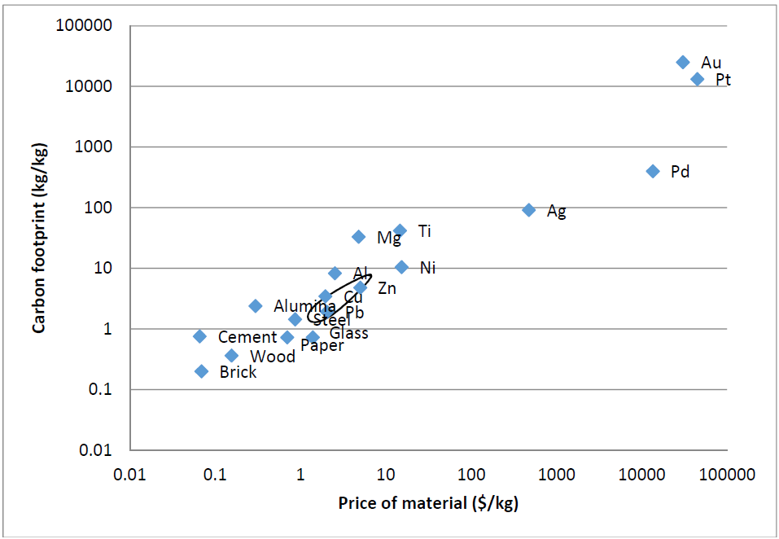

# Resource Stress

Resource stress is created when the use of a resource results in stress on our society or the environment,
for example through wars, shortage of potable water, pollution of air and soil, risk of floods or loss of
jobs or loss of biodiversity, while, at the same time, the resource is essential for making products and
services that add significantly to our standard of living. The production of materials and energy (e.g.
heat, electricity, reducing agents) involves the use of massive amounts of stressed resources. Examples
are oil and gas, the [capacity of the biosphere for CO<sub>2</sub>](https://njeapp2.github.io/RWE-Track/Atom3/Page3), some ore deposits and sources of fresh water.

Since we aim to minimize the stress of production and consumption, resource stress is an important
issue. Unfortunately, there are no perfect indicators for resource stress. The use of 1 m<sup>3</sup> of fresh water,
for example, may create more stress in a dry region than in a wet region, or during a dry season versus
a wet season, and of course local population density and culture play a role as well. In general, each
element of resource stress links to a certain geographic scale and to a political process of the
community within that geography determining how much stress is created and how to translate that
stress into taxes (or subsidies). If political processes are effective, the net stress from resources may be
assessed by adding up taxes and subsidies involved in making products and services.

There are several caveats in simply using taxes and subsidies as a measure for the resource stress of a
product or service, even if political processes are effective. One issue is that governments often add up
various externalities into one overall tax or subsidy. For example, an industry may get a subsidy to start
an operation at some location because of the jobs it offers. In this case, the pollution produced by the
industrial operation may be considered less important than the stress of jobless people, and so the
subsidy essentially covers the combined effects of pollution and job creation. This is not an essential
problem, but it shows that the apparent absence of a tax does not mean that the political process was
not effective. A more serious problem is that stresses like resource scarcity and global warming act on a
worldwide scale, and there exists no government that is able to tax at this scale.

Given that there is no perfect indicator for resource stress, it is proposed here to use the cost of
materials and energy used in making a product or service as a proxy. Market prices of materials and
energy include taxes and subsidies, and therefore account for the net stresses on local societies. The
same prices also automatically increase with scarcity, competition and conflicts over access to oil, gas
and ores. Finally, materials are presently made using fossil fuels, and so (accidentally) their cost
correlates strongly with their carbon footprint and global warming potential (see figure below). We
should note that the price of materials and energy is not a perfect measure of resource stress because
governments are not always effective and also the cost of fully sustainable resources, such as labour or
capital, are included in prices. Nevertheless, these latter components are usually not dominating, while
important stresses are. Therefore material and energy prices are helpful as a proxy for resource stress.

Market prices of materials and energy are established by the balance of their *maximum* cost of
production (with a considerable component proportional to resource stress) and their *minimal* value in
making products and services. Therefore, the cost of materials and energy in producing some product
or service *X* may be used as an indicator for its *marginal* resource stress:

<!-- ```html -->
<html>
  <head>
    <script src="https://polyfill.io/v3/polyfill.min.js?features=es6"></script>
    <script src="https://cdn.mathjax.org/mathjax/latest/MathJax.js?config=TeX-AMS_CHTML"></script>
  </head>
  <body>
    <p>
      $$ Resource \: stress \: (X) \approx \sum_{energy \: carriers} energy * market \: price + \sum_{materials} mass * market \: price $$
    </p>
  </body>
</html>

<p align="center">

</p>

<p align="center">
<sub>Correlation of the prices of materials (bulk polymers indicated by an ellipse) and their carbon footprints, both per unit mass
(data taken from T.G. Gutowski, S. Sahni, J.M. Allwood, M.F. Ashby and E. Worrell, <i>The energy required to produce
materials: constraints on energy-intensity improvements, parameters of demand</i>, Philosophical Transactions: Mathematical,
Physical and Engineering Sciences, <b>371</b>, Material efficiency: providing material services with less material production, 13
March 2013, pp. 1-14).</sub>
</p>

Click [here](https://njeapp2.github.io/RWE-Track/Atom10/Page10) to continue reading.

